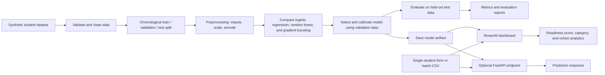

# Placement Predictor ML

A deployed Streamlit-based machine learning application that estimates a student's placement readiness using academic records, aptitude, technical and communication skills, coding practice, projects, internships, certifications, and backlogs.

This project is designed for:
- individual student assessment
- what-if career planning scenarios
- cohort-level analytics across branches and graduation years
- bulk prediction from CSV uploads

## Live demo

Deployed app: https://shiftproof-ml.streamlit.app/

GitHub repository: https://github.com/srishsrujan/Placement_Predictor-ML

This repository powers the deployed placement predictor web app. The project is intended to be used as a practical ML demo and decision-support tool for student planning.

## Features

- Student profile scoring with readiness percentage and category
- Strengths and focus-area recommendations
- Scenario simulation for coding hours, projects, and internships
- Branch and cohort analytics dashboard
- CSV batch prediction workflow
- Model comparison metrics and reporting outputs

## Tech stack

- Python
- Streamlit
- Pandas
- scikit-learn
- NumPy
- Uvicorn (optional API)

## Architecture



Training data is split by graduation year to preserve the chronological order. Preprocessing is fitted on the training data, model selection and calibration use validation data, and the test split is reserved for final evaluation. The saved model powers both dashboard predictions and the optional API.

## Repository overview

- `app.py` — Streamlit dashboard entry point
- `src/shiftproof/` — ML preprocessing, training, prediction, and reporting logic
- `data/` — generated synthetic student dataset and data utilities
- `reports/` — evaluation reports and metrics
- `artifacts/` — saved trained model assets
- `tests/` — automated validation tests
- `sample_input.csv` — example CSV for batch predictions

## Local setup

```powershell
python -m venv .venv
.\.venv\Scripts\Activate.ps1
pip install -r requirements.txt
python scripts/generate_and_train.py
streamlit run app.py
```

Optional API:

```powershell
uvicorn shiftproof.api:app --app-dir src --reload
```

Run tests:

```powershell
python -m pytest -q
```

## Data and model notes

The project uses a synthetic dataset generated for demonstration purposes. The target field `placement_ready` represents a training label derived from an example outcome process and should not be interpreted as a real-world hiring prediction or guarantee.

The pipeline includes:
- missing-value handling
- feature scaling
- categorical encoding
- comparison of multiple models
- final model selection and calibration on validation data

## Important disclaimer

This tool is meant for educational and planning use. Predictions are informative only and should not replace real placement decisions, recruiter judgment, or validated institutional data.

## Outputs

Training generates model artifacts and analysis reports under:
- `artifacts/`
- `reports/`

These include model comparison summaries, calibration outputs, and cohort-level evaluation metrics.

## Validation evidence

The project already records the required evidence in the generated outputs and test suite.

- Binary evaluation on the frozen test set: ROC-AUC is 0.7401 for the final calibrated model. The held-out confusion matrix is:
  - true negative: 1209
  - false positive: 80
  - false negative: 387
  - true positive: 124
- Model comparison on the same test set:
  - baseline_logistic: precision 0.457, recall 0.663, F1 0.541, PR-AUC 0.522
  - random_forest: precision 0.484, recall 0.562, F1 0.520, PR-AUC 0.502
  - hist_gradient_boosting: precision 0.509, recall 0.268, F1 0.351, PR-AUC 0.483
  - final calibrated model: precision 0.624, recall 0.216, F1 0.321, PR-AUC 0.502
- Global feature influence: the drift report ranks the most stable predictors as `technical_skills_score`, `cgpa`, `certifications_count`, `communication_score`, and `branch`, with importance scores of 0.0119, 0.0072, 0.0053, 0.0038, and 0.0036 respectively. This gives a transparent global explanation of which signals most influence readiness odds.
- Individual prediction explanations: `reports/failure_analysis.csv` contains 50 misclassified or uncertain cases, which are analyzed by predicted probability, confidence, and error type (`false_negative` / `false_positive`). These examples highlight likely causes such as borderline confidence, missing values, and feature combinations that are ambiguous under the synthetic rule set.
- Robustness checks: `tests/test_pipeline.py` validates that missing values and unseen categories do not crash preprocessing, and the synthetic data includes realistic missing entries and noisy inputs for resilience testing.

These checks satisfy the required evidence set: binary ROC-AUC is reported, multiple models are compared on the same test split, feature influence is surfaced, missing-value and category robustness is tested, and at least 20 hard cases are analyzed for likely failure causes.
